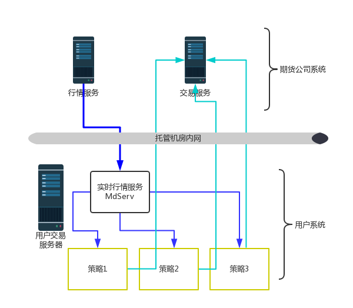

### 托管版期货交易系统

*注：非开源软件，可定制，需要者请与我们联系。 QQ:17626852, http://www.myquant.cn*

托管版期货交易系统为了方便用户进行策略托管，是针对低延时策略的开发和生产部署两个问题的解决方案。

系统内置行情业务模块有实时行情服务、订阅和分发客户端接口，实时的K线合成服务。

交易业务模块有下单接口，仓位和账户查询接口、仓位管理模块。

辅助工具有合约信息配置与查询、保证金和佣金计算、持仓浮盈计算接口。

**品种支持**： 目前支持的交易品种包括所有商品和金融期货，以及商品期货的期权。

**策略类别**： 各类CTA策略，包括套利、择时、趋势等，支持短时高频策略。

**柜台支持**：支持CTP和CTP Mini。

**操作系统**：Ubuntu Linux 64Bit

**策略开发语言**：C++，Python


#### 系统架构



**建议配置**： 多策略共用一台实时行情分发服务，运行在同一台机器上，方便部署。

​		    *如有需要，也可为某个策略单独配置和部署实时行情分发服务，多个实时行情分发共存于同一台电脑时需要配置不同的通讯参数。*

**通讯链路说明**：

- 用户策略通过SDK与实时行情服务通讯，订阅Tick和K线
- 策略与交易柜台直接通讯交易，不经过任何其他服务
- 策略之间彼此没有通讯链路，互不影响。


#### 建议配置参数

具体根据策略需要，可以灵活配置，通常如下配置的服务器即可支持50个一般复杂度策略。

DELL PowerEdge R730:
​    CPU:   2颗Intel(R)至强4核E5-2630 V2(2.4GHz, 15M 缓存, 8.0GT/s QPI, Turbo,8C,)
​    内存：16GB 
​    硬盘：1.2TB SAS 10K 2.5寸

#### Demo下载体验

体验版本仅支持操作系统 Ubuntu x86_64.

使用方法：

1. curl或wget下载MdSer和DemoStrategy两个文件分别到不同的目录，例如：

   ```bash
   mkdir -p  ~/gm_opt/serv
   mkdir -p ~/gm_opt/demo
   ```

2.  分别让文件可执行

   ```bash
   cd ~/gm_opt/serv && chmod +x MdServ
   cd ~/gm_opt/demo && chmod +x DemoStrategy
   ```

3.  分别执行相应文件，如有问题请联系。

   ```
   cd ~/gm_opt/serv && ./MdServ
   cd ~/gm_opt/demo && ./DemoStrategy
   ```

4. 文件执行中会在当前目录下创建logs目录，并释出一些文件，内容可供参考。

   ```
   __ serv
     |_logs\
     |_contracts.json
     |_setting.json
   ```

   ```
   __ demo
     |_logs\
     |_python\
         |_test.py
         |_riskcontrol.py
         |_gmsdk**.whl
     |_contracts.json
     |_setting.json
     |_session.json
     |_demo.cc
   ```


*注：C++ 头文件和相关依赖没有提供，如有需要请联系QQ17626852，欢迎商务合作。*

python文件释出在python目录下，可安装其中的whl文件和参考python策略写法。

```bash
   pip3 install gmsdk-1.0.0-cp36-cp36m*.whl
```

